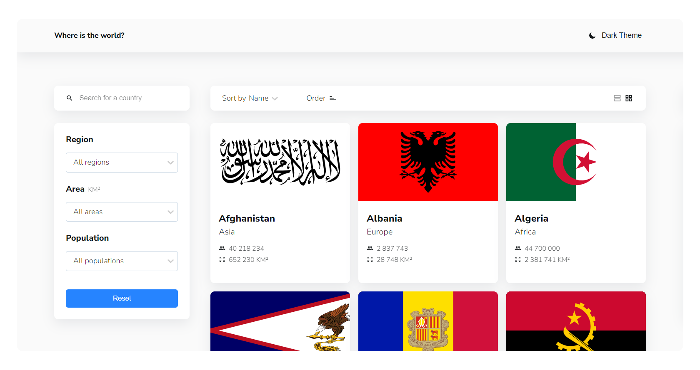
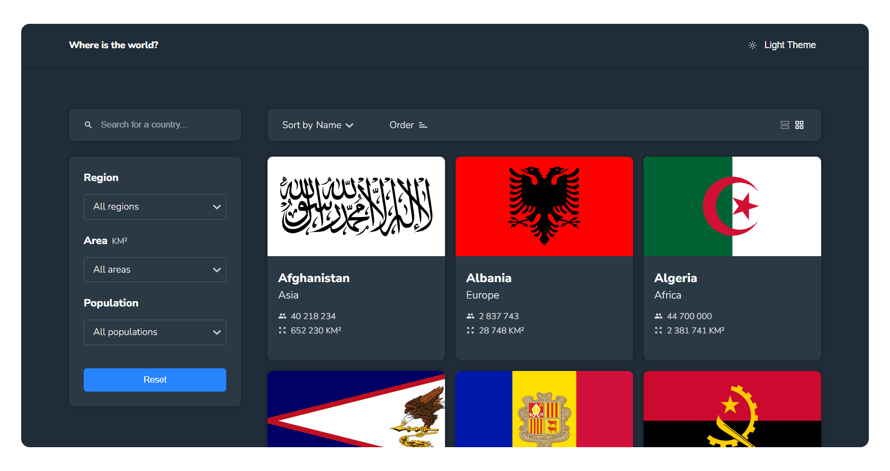
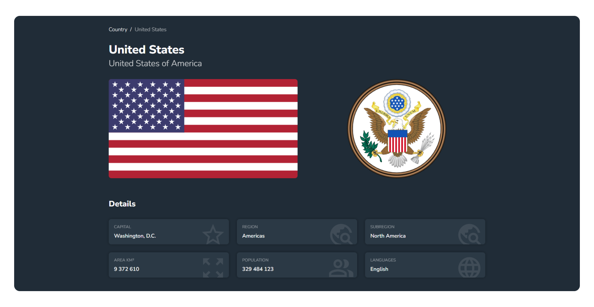

# REST Countries API with color theme switcher 

The web application helps you find general background information about countries: flag, area, population, capital, language, land borders and etc.

## Features

- See all countries from the API on the homepage
- Search for a country using an `input` field
- Filter countries by region, area and population
- Sort countries  by name, area, population
- Change between ASC and DESC sort
- Grid view  and list view for countries
- Click on a country to see more detailed information on a separate page
- Click through to the border countries on the detail page
- Toggle the color scheme between light and dark mode

## Screenshot

## Links

- Solution URL: https://github.com/FightM9/typescript-rest-countries-api
- Live Site URL:  https://typescript-rest-countries-api.netlify.app/

## Process

### Built with

- Semantic HTML5 markup
- CSS custom properties
- Flexbox
- CSS Grid
- Mobile-first workflow
- [Typescript](https://www.typescriptlang.org/) - Syntactical superset of JavaScript
- [React](https://reactjs.org/) – JS library
- [React Router v6](https://reactrouter.com/) – for page routing
- [React Select](https://react-select.com/) – Select Input control
- [React Icons](https://react-icons.github.io/react-icons/) – Icons library
- [Redux Toolkit](https://redux-toolkit.js.org/)  – A predictable state container for JavaScript applications
- [CSS Modules](https://github.com/css-modules/css-modules) – For styles
- [Axios](https://axios-http.com/) – Http Client
- [Redux-thunk](https://github.com/reduxjs/redux-thunk) – middleware for Redux. 

### Useful resources

- [React Docs ](https://reactjs.org/)
- [Redux Toolkit Docs](https://redux-toolkit.js.org/introduction/getting-started)
- [Redux Docs](https://redux.js.org/)
- [React Select](https://react-select.com/)
- [Typescript Handbook](https://www.typescriptlang.org/docs/handbook/intro.html)
